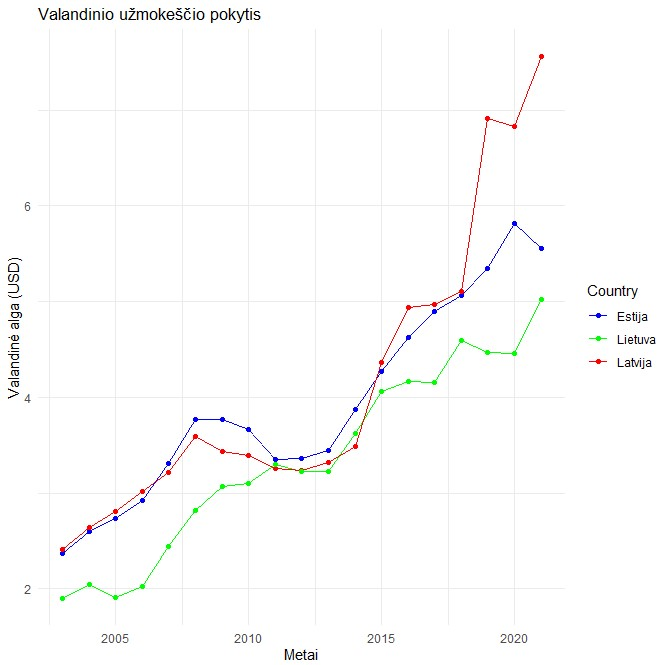
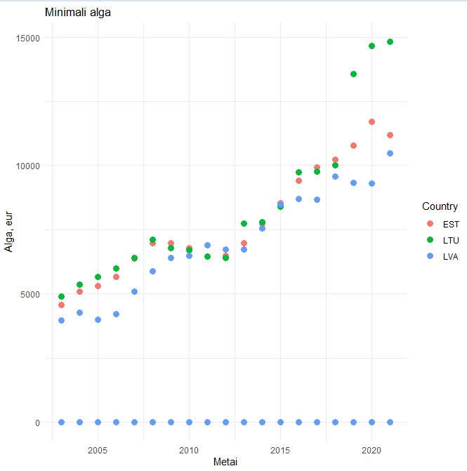

```{r}
countries <- c("Estonia", "Lithuania", "Latvia")
filtered_data <- data[data$Country %in% countries, ]

plot <- ggplot(filtered_data, aes(x = TIME, y = Value, color = Country)) +
  geom_line() +
  geom_point() +
  labs(x = "Metai", y = "Valandinė alga (USD)", title = "Valandinio užmokeščio pokytis") +
  scale_color_manual(values = c("blue", "green", "red"), labels = c("Estija", "Lietuva", "Latvija")) +
  theme_minimal()

plot
```

  

---

```{r}
filtered_data <- data %>%
  filter(SERIES == "PPP") %>%
  select(COUNTRY, Time, Value) %>%
  rename(Country = COUNTRY, Year = Time, PPP = Value)

ggplot(filtered_data, aes(x = Year, y = PPP, color = Country)) +
  geom_point(size = 3) +
  labs(x = "Metai", y = "Alga, eur", title = "Minimali alga") +
  theme_minimal()
```



---
    
```{r}
# Load needed libraries
library(tidyverse)

# Read data files
minimum_wages <- read.csv("MinimumWagesBalticsPPP.csv")
well_being <- read.csv("WellBeing.csv")

# Filter well_being data for Deaths from suicide, alcohol, drugs
deaths_suicide_alcohol_drugs <- well_being %>%
  filter(VARIABLE == "5_3", TIME >= 2003) %>%
  select(Country = LOCATION, Year = TIME, Deaths = Value)

# Filter minimum_wages Hourly and Year
hourly_minimum_wages <- minimum_wages %>%
  filter(PERIOD == "H", TIME >= 2003) %>%
  select(Country = COUNTRY, Year = TIME, HourlyMinimumWage = Value)

# Merge datasets
merged_data <- merge(deaths_suicide_alcohol_drugs, hourly_minimum_wages, by = c("Country", "Year"))

# Calculate correlations
correlation <- cor(merged_data$HourlyMinimumWage, merged_data$Deaths)

# Visualize
ggplot(merged_data, aes(x = HourlyMinimumWage, y = Deaths, col = Country)) +
  geom_point(size=3) +
  geom_smooth(method = "lm", linetype = "dashed", se = FALSE) +
  labs(x = "Hourly Minimum Wage",
       y = "Deaths from suicide, alcohol, drugs",
       title = paste("Correlation: ", round(correlation, 2))) +
  scale_color_manual("Country", values = c(EST = "blue", LTU = "red", LVA = "green")) +
  theme_minimal() +
  theme(legend.position = "bottom") +
  facet_wrap(~Year, nrow = 3) 

```

